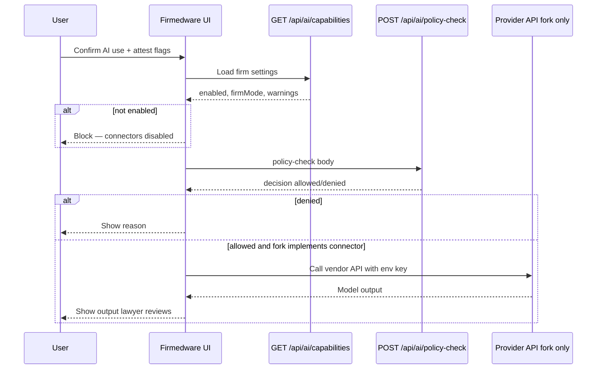

# AI Connector Gateway — setup & API integration

> **Bilingual / สองภาษา:** English first, then Thai (`ภาษาไทย`).

Firmedware v1.2 ships an **AI Connector Gateway** — policy types, firm settings, admin UI, and HTTP routes that **check whether a request is allowed**. Core does **not** call OpenAI, Anthropic, Gemini, Perplexity, or local inference endpoints. Provider API keys are **not** stored in the database.

**ภาษาไทย:** แกนหลัก v1.2 มีเฉพาะเกตเวย์ตรวจนโยบาย ไม่เรียก API ผู้ให้บริการ AI และไม่เก็บ API key ในฐานข้อมูล

Related: [SECURITY.md § AI connector governance](./SECURITY.md#ai-connector-governance--การกำกับดูแล-ai-connectors) · [EXTENSIONS.md § AI](./EXTENSIONS.md#ai-connector-gateway--เกตเวย์ตัวเชื่อม-ai) · [Thailand AI use policy template](./jurisdictions/thailand/ai-use-policy.md)

---

## Contents / สารบัญ

- [What exists in v1.2](#what-exists-in-v12)
- [Before you enable anything](#before-you-enable-anything)
- [Admin setup (firm UI)](#admin-setup-firm-ui)
- [Connector modes](#connector-modes)
- [HTTP API](#http-api)
- [Integration flow (recommended)](#integration-flow-recommended)
- [Fork: add a provider API call](#fork-add-a-provider-api-call)
- [Environment variables](#environment-variables)
- [Activity logging](#activity-logging)
- [Testing](#testing)

---

## What exists in v1.2

| Piece | Location | Behavior |
|-------|----------|----------|
| Types & policy engine | `src/lib/ai/types.ts`, `policy.ts`, `redaction.ts` | Conservative allow/deny rules |
| Firm gate | `src/lib/ai/gateway.ts` | Requires `enableAIConnectors` + non-`DISABLED` firm mode |
| Provider registry | `src/lib/ai/registry.ts` | All providers `enabled: false` |
| Admin UI | `/admin/ai-connectors` | Toggle + mode + preferred provider label |
| API | `GET /api/ai/capabilities`, `POST /api/ai/policy-check` | Session auth; **no vendor HTTP** |
| DB fields | `FirmSettings.enableAIConnectors`, `aiConnectorMode`, `aiConnectorProvider` | Metadata only |

**Who may call the API:** signed-in **Admin**, **Lawyer**, or **Staff** (not **Viewer**).

---

## Before you enable anything

Complete the governance checklist in [README § AI connector governance](../README.md#ai-connector-governance-checklist) and adopt a **written firm AI use policy** (template: [jurisdictions/thailand/ai-use-policy.md](./jurisdictions/thailand/ai-use-policy.md)).

**Default:** leave **Admin → AI connectors** disabled until partners approve.

**ภาษาไทย:** อย่าเปิดตัวเชื่อม AI จนกว่าจะมีนโยบายเป็นลายลักษณ์และทบทวนโดยผู้มีอำนาจ

---

## Admin setup (firm UI)

**Who:** Admin only  
**Where:** **Admin → AI connectors** (`/admin/ai-connectors`)

| Step | Action |
|------|--------|
| 1 | Confirm written AI policy exists (partners / compliance). |
| 2 | Check **Enable AI connectors** only if policy allows. |
| 3 | Set **Connector mode** (see [modes](#connector-modes) below). |
| 4 | Set **Preferred provider** (`OPENAI`, `ANTHROPIC`, `GOOGLE_GEMINI`, `PERPLEXITY`, `LOCAL_MODEL`, or `OTHER` + label). This is **metadata for policy/UI** — not an API key. |
| 5 | Save. If enable is off, mode is forced to `DISABLED` in the database. |

**Production:** store real provider keys in the **server environment** or secret manager when you implement a fork connector — never in **Admin → Settings**, Prisma, or git.

**ภาษาไทย:** ตั้งค่าที่ Admin → AI connectors หลังมีนโยบาย เก็บ API key ใน env ของเซิร์ฟเวอร์เท่านั้น

---

## Connector modes

Firm setting `aiConnectorMode` (and per-request `mode` in the API) must align.

| Mode | Intended use | Main restrictions |
|------|----------------|-------------------|
| `DISABLED` | Off | All policy checks deny (unless firm toggle is also off). |
| `PUBLIC_RESEARCH_ONLY` | Public law / market research, no client facts | No client confidential info, privileged info, document links, local paths, or personal data. |
| `WORKFLOW_TEMPLATES_ONLY` | Generic templates (statuses, checklists, translation patterns) | Purposes like `WORKFLOW_TEMPLATE`, `CHECKLIST_DRAFT`, `TRANSLATION`, `STATUS_TAXONOMY` — no client-specific or privileged content. |
| `REDACTED_CONTEXT_ONLY` | Help after redaction | `REDACTED_MATTER_HELP` — flags if client identifiers should be redacted; privileged info blocked unless approval mode applies. |
| `CONFIDENTIAL_WITH_APPROVAL` | Highest risk | Privileged content requires `adminApproved: true` on the API request. |

Per-request policy also blocks **external document links** and **local paths** by default (including heuristic detection in prompt text).

---

## HTTP API

All routes require an authenticated session (Auth.js cookie). Call from the Firmedware origin in the browser, or forward the session cookie from a trusted server-side integration.

### `GET /api/ai/capabilities`

Returns firm AI settings and the provider registry (all disabled in core).

**Response (example):**

```json
{
  "enabled": false,
  "firmMode": "DISABLED",
  "firmProvider": null,
  "providers": {
    "OPENAI": { "enabled": false, "label": "OpenAI / ChatGPT" },
    "ANTHROPIC": { "enabled": false, "label": "Anthropic Claude" }
  },
  "supportedModes": ["DISABLED", "PUBLIC_RESEARCH_ONLY", "..."],
  "warnings": ["AI connectors are disabled by default. ..."]
}
```

**Use:** drive UI (show warnings, disable buttons when `enabled` is false).

---

### `POST /api/ai/policy-check`

Evaluates firm gate + policy. **Does not call any AI provider.**

**Headers:** `Content-Type: application/json`  
**Body:** validated by `aiPolicyCheckBodySchema` (`src/lib/validations/ai-connector.ts`)

| Field | Type | Required | Notes |
|-------|------|----------|-------|
| `provider` | enum | yes | `OPENAI`, `ANTHROPIC`, `GOOGLE_GEMINI`, `PERPLEXITY`, `LOCAL_MODEL`, `OTHER` |
| `mode` | enum | yes | Must match firm policy expectations |
| `purpose` | enum | yes | `PUBLIC_RESEARCH`, `WORKFLOW_TEMPLATE`, `CHECKLIST_DRAFT`, `TRANSLATION`, `STATUS_TAXONOMY`, `REDACTED_MATTER_HELP`, `OTHER` |
| `prompt` | string | yes | Max 32,000 chars — **do not log full text in activity by default** |
| `contextSummary` | string | no | Max 8,000 chars |
| `matterId` | string | no | For audit metadata only |
| `clientId` | string | no | For audit metadata only |
| `includesClientConfidentialInfo` | boolean | yes | User attestation |
| `includesPrivilegedInfo` | boolean | yes | User attestation |
| `includesPersonalData` | boolean | yes | User attestation |
| `includesExternalDocumentLinks` | boolean | yes | User attestation; also auto-detected in text |
| `includesLocalPaths` | boolean | yes | User attestation; also auto-detected in text |
| `userConfirmed` | boolean | yes | Must be `true` or request is denied |
| `adminApproved` | boolean | no | Required for privileged content in `CONFIDENTIAL_WITH_APPROVAL` |
| `otherProviderLabel` | string | no | Required when `provider` is `OTHER` (or set in firm settings) |

**Example request:**

```bash
curl -sS -b "your-session-cookie" \
  -H "Content-Type: application/json" \
  -X POST "https://your-firm.example.com/api/ai/policy-check" \
  -d '{
    "provider": "OPENAI",
    "mode": "WORKFLOW_TEMPLATES_ONLY",
    "purpose": "WORKFLOW_TEMPLATE",
    "prompt": "Draft a generic matter intake checklist for a corporate transaction (no client names).",
    "includesClientConfidentialInfo": false,
    "includesPrivilegedInfo": false,
    "includesPersonalData": false,
    "includesExternalDocumentLinks": false,
    "includesLocalPaths": false,
    "userConfirmed": true
  }'
```

**Example response:**

```json
{
  "decision": {
    "allowed": true,
    "reason": "Request permitted by policy (no provider call is made by this check).",
    "shouldLogPrompt": false,
    "shouldLogOutput": false
  },
  "advisory": {
    "detectedExternalLinks": 0,
    "detectedLocalPaths": 0
  }
}
```

**Denied example** (`userConfirmed: false`):

```json
{
  "decision": {
    "allowed": false,
    "reason": "User confirmation is required before any AI policy check or request.",
    "shouldLogPrompt": false,
    "shouldLogOutput": false
  },
  "advisory": { "detectedExternalLinks": 0, "detectedLocalPaths": 0 }
}
```

**Status codes:** `401` unsigned, `403` Viewer, `400` validation error.

---

## Integration flow (recommended)

Use this sequence in a custom UI, browser extension, or fork feature:



1. **Load capabilities** — hide AI actions if `enabled` is false.  
2. **Collect explicit user confirmation** — set `userConfirmed: true` only after a checkbox/disclaimer.  
3. **Collect attestation flags** — client confidential, privileged, personal data, links, paths (honest user input; policy also scans prompt text for links/paths).  
4. **Call policy-check** — if `decision.allowed` is false, stop; show `reason`.  
5. **Optional fork step** — call provider only when allowed; use env API key; never auto-export DB rows or document URLs.  
6. **Log metadata** — use `AI_REQUEST_CREATED` / `AI_OUTPUT_GENERATED` kinds in forks; do not log full prompts/outputs unless firm policy explicitly requires it.

**Do not:**

- Send matter notes, client names, or document links by default  
- Store API keys in `FirmSettings` or the repo  
- Let AI mutate Prisma records or export activity logs  
- Fetch or proxy Google Drive / SharePoint content through Firmedware  

---

## Fork: add a provider API call

Core intentionally stops at policy-check. To **execute** a model call:

### 1. Enable firm settings

Admin enables connectors and sets mode via **Admin → AI connectors**.

### 2. Add environment variables

On the app server (see [Environment variables](#environment-variables)).

### 3. Create a connector module

Example layout:

```text
src/lib/ai/connectors/openai.ts   # server-only ("use node" if needed)
src/app/api/ai/complete/route.ts  # optional new route — Admin/Lawyer/Staff only
```

**Pattern:**

```typescript
import { evaluateFirmAIPolicy } from "@/lib/ai/gateway";
import { aiProviderRegistry } from "@/lib/ai/registry";

export async function runOpenAIConnector(
  request: AIConnectorRequest,
  user: SessionUser
): Promise<{ text: string } | { error: string }> {
  if (!aiProviderRegistry.OPENAI.enabled) {
    return { error: "OpenAI connector is not enabled in this deployment." };
  }

  const decision = await evaluateFirmAIPolicy(request);
  if (!decision.allowed) {
    return { error: decision.reason };
  }

  const apiKey = process.env.OPENAI_API_KEY;
  if (!apiKey) {
    return { error: "OPENAI_API_KEY is not configured." };
  }

  // Build prompt from user-supplied text only — do not prisma.client.findMany() into the prompt.
  const response = await fetch("https://api.openai.com/v1/chat/completions", {
    method: "POST",
    headers: {
      Authorization: `Bearer ${apiKey}`,
      "Content-Type": "application/json",
    },
    body: JSON.stringify({
      model: process.env.OPENAI_MODEL ?? "gpt-4o-mini",
      messages: [{ role: "user", content: request.prompt }],
    }),
  });

  if (!response.ok) {
    return { error: "Provider request failed." };
  }

  const data = await response.json();
  const text = data.choices?.[0]?.message?.content ?? "";
  // Log AI_OUTPUT_GENERATED metadata only unless firm policy requires more.
  return { text };
}
```

### 4. Enable provider in registry

In `src/lib/ai/registry.ts`, set `OPENAI: { enabled: true, label: "..." }` only in forks that are ready for production and have passed security review.

### 5. Custom GPT / external tools

For **ChatGPT Custom GPT Actions** or Postman:

- Use the same JSON body as `POST /api/ai/policy-check`.  
- Authenticate with a session cookie or a future fork-specific API token (not in core v1.2).  
- Treat policy-check as a **gate**; run the OpenAI call in your action only when `decision.allowed` is true.

---

## Environment variables

Add to server `.env` or secret manager (**never** commit real keys):

| Variable | Purpose |
|----------|---------|
| `OPENAI_API_KEY` | OpenAI / ChatGPT API |
| `OPENAI_MODEL` | Optional model id (fork default e.g. `gpt-4o-mini`) |
| `ANTHROPIC_API_KEY` | Claude API |
| `GOOGLE_GEMINI_API_KEY` | Gemini API |
| `PERPLEXITY_API_KEY` | Perplexity API |
| `LOCAL_AI_BASE_URL` | Optional base URL for on-prem inference |
| `LOCAL_AI_API_KEY` | Optional key for local gateway |

Core v1.2 **does not read** these variables. Copy from [.env.example](../.env.example) when implementing a fork.

---

## Activity logging

Policy checks log **metadata only** (`metadata.kind: AI_POLICY_CHECKED`) — provider, mode, purpose, matter/client ids, allow/deny. **No prompt body, no model output, no API keys.**

Future fork kinds (constants in `src/lib/ai/activity.ts`):

- `AI_REQUEST_CREATED`, `AI_OUTPUT_GENERATED`, `AI_REQUEST_BLOCKED`, `AI_CONNECTOR_ENABLED`, `AI_CONNECTOR_DISABLED`, `AI_PROVIDER_CHANGED`

---

## Testing

```bash
npm run test:ai
```

Covers AI-GW-001 … AI-GW-012 (policy engine, API routes, firm gate, no provider HTTP in core).

Full catalog: [EDGE_CASE_TEST_PLAN.md § AI Connector Gateway](./EDGE_CASE_TEST_PLAN.md) (section O-bis).

---

## Quick reference

| Task | Where |
|------|--------|
| Firm policy & checklist | [README § AI connector governance](../README.md#ai-connector-governance-checklist) |
| Lawyer-facing steps | [LAWYER_FIRM_SETUP § AI connectors](./LAWYER_FIRM_SETUP.md#ai-connectors--ตัวเชื่อม-ai) |
| Fork patterns | [EXTENSIONS.md § AI](./EXTENSIONS.md#ai-connector-gateway--เกตเวย์ตัวเชื่อม-ai) |
| Security detail | [SECURITY.md § AI Connector Gateway](./SECURITY.md#ai-connector-gateway--เกตเวย์ตัวเชื่อม-ai) |
