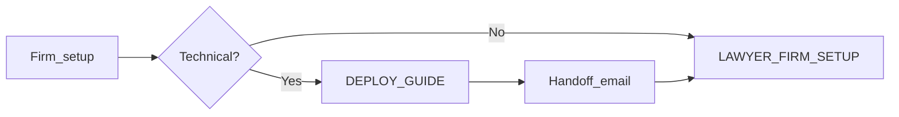

# Firm setup index / ดัชนีติดตั้งสำนักงาน

> **One screen** — links only. Narrative guides: [START_HERE.md](./START_HERE.md).

**ภาษาไทย:** หน้าเดียว — ลิงก์เท่านั้น คำอธิบายเต็มที่ [START_HERE.md](./START_HERE.md)

---

## Choose your role / เลือกบทบาท

| I am… | Open |
|--------|------|
| IT, developer, office tech | **[DEPLOY_GUIDE.md](./DEPLOY_GUIDE.md)** |
| Lawyer or office manager **with a login URL** | **[LAWYER_FIRM_SETUP.md](./LAWYER_FIRM_SETUP.md)** |
| Not sure | **[START_HERE.md](./START_HERE.md)** |

---

## Firm size / ขนาดสำนักงาน

| Size | People | Deploy | Lawyer setup |
|------|--------|--------|----------------|
| **Mini team** | 1–4 | [DEPLOY § Mini](./DEPLOY_GUIDE.md#mini-team-14-people) | [LAWYER § Mini](./LAWYER_FIRM_SETUP.md#mini-team-14-people) |
| **Small firm** | 5–15 | [DEPLOY § Small](./DEPLOY_GUIDE.md#small-firm-515-people) | [LAWYER § Small](./LAWYER_FIRM_SETUP.md#small-firm-515-people) |
| **16+** | Not v1.2 as-is | [EXTENSIONS.md](./EXTENSIONS.md) — fork & develop | Same |

---

## Ordered steps (typical firm) / ลำดับขั้นตอน

| Step | Who | Doc |
|------|-----|-----|
| 1. Deploy app + database | Technical | [DEPLOY_GUIDE § Core](./DEPLOY_GUIDE.md#core-deploy-all-sizes--ติดตั้งหลัก-ทุกขนาด) |
| 2. HTTPS, backups, restore test | Technical | [DEPLOY § Production](./DEPLOY_GUIDE.md#production-hardening-all-sizes--เสริมความปลอดภัย-production) |
| 3. Email URL + logins to staff | Technical | [DEPLOY § Handoff](./DEPLOY_GUIDE.md#handoff-to-lawyers--ส่งมอบให้ทนายความ) |
| 4. Firm settings + security | Lawyer/admin | [LAWYER § Day 1](./LAWYER_FIRM_SETUP.md#day-1--firm-settings--วันแรก--ตั้งค่าสำนักงาน) |
| 5. Users, roles, groups (5–15) | Lawyer/admin | [LAWYER § Day 2](./LAWYER_FIRM_SETUP.md#day-2--people--วันที่สอง--ผู้ใช้) |
| 6. Go-live on new matters | Everyone | [LAWYER § Go-live](./LAWYER_FIRM_SETUP.md#go-live-gate--เมื่อไหร่ถึงใช้ข้อมูลลูกความจริง) |
| 7. Deep reference (documents, audit) | As needed | [SETUP_PLAYBOOK §§3–6](./SETUP_PLAYBOOK.md#3-security-measures--3-มาตรการความปลอดภัย) |

---

## Printable checklists / เช็กลิสต์พิมพ์

- Mini team (1–4): [LAWYER § Mini checklist](./LAWYER_FIRM_SETUP.md#mini-team-go-live-1-4)
- Small firm (5–15): [LAWYER § Small checklist](./LAWYER_FIRM_SETUP.md#small-firm-go-live-5-15)

---

## Also useful / อื่นๆ

| Topic | Link |
|-------|------|
| Security model | [SECURITY.md](./SECURITY.md) |
| Thailand templates | [jurisdictions/thailand/](./jurisdictions/thailand/README.md) |
| Production checklist (README) | [Minimum production checklist](../README.md#minimum-production-checklist) |
| All documentation | [docs/README.md](./README.md) |
